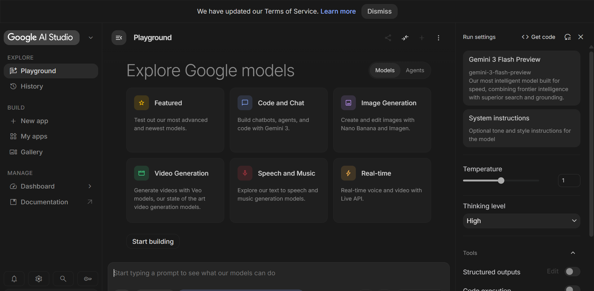
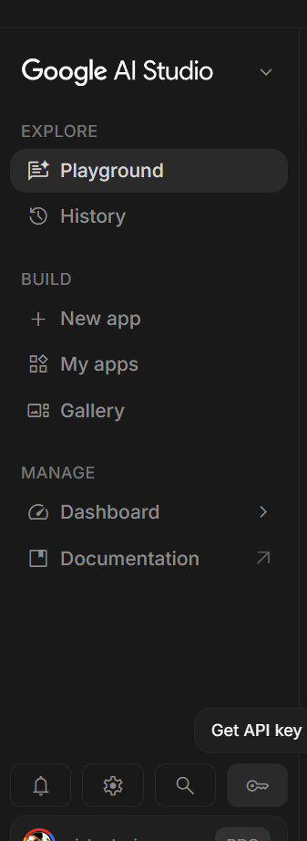
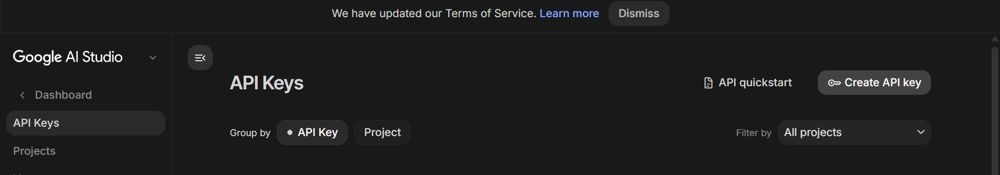
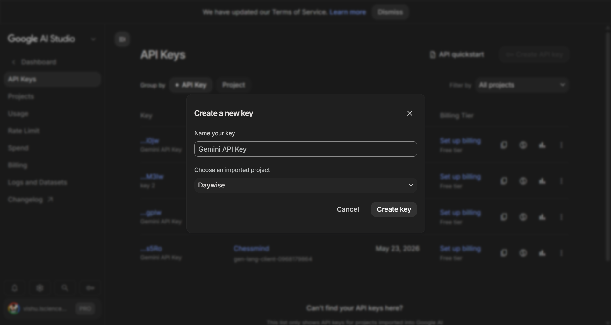
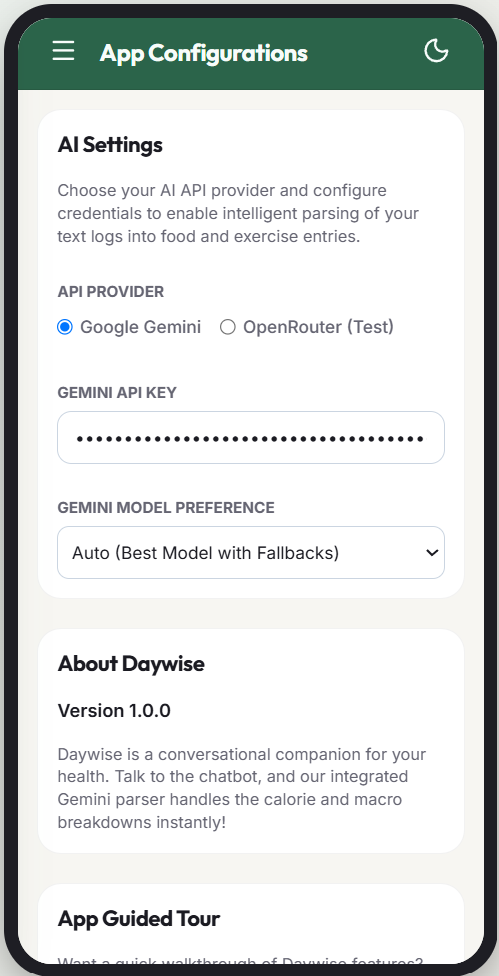

# 🔑 How to Get a Free Google Gemini API Key

Daywise uses Google Gemini to recognize and parse your natural language logs. Follow these steps to obtain a free Gemini API key:

---

### Step 1: Visit Google AI Studio
1. Open your browser and go to the official Google AI Studio website: [https://aistudio.google.com/](https://aistudio.google.com/)
2. Log in using your standard Google account (Gmail).

---

### Step 2: Create an API Key
1. Once logged in, look at the top-left sidebar and click the **"Get API key"** button.
2. In the modal that opens, click the **"Create API key"** button.

---

### Step 3: Choose Project & Generate
1. You can choose to create a key in a new Google Cloud project or an existing one. Select **"Create API key in new project"**.
2. Wait a few seconds for the system to generate your key.

---

### Step 4: Copy the API Key
1. A popup will display your active API key. Click the **"Copy"** button to copy it to your clipboard.
2. ⚠️ *Important: Never share your API key publicly. Keep it private.*

---

### Step 5: Save key in Daywise
1. Open the Daywise application.
2. Navigate to **Menu (Hamburger Icon) > Settings**.
3. Under **API Provider**, select **Google Gemini**.
4. Paste the copied key into the **Google Gemini API Key** input field.
5. The settings will save automatically!

