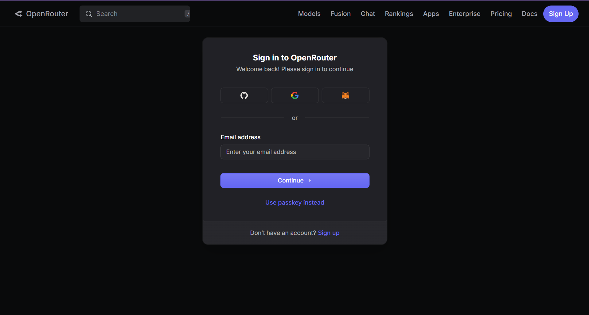
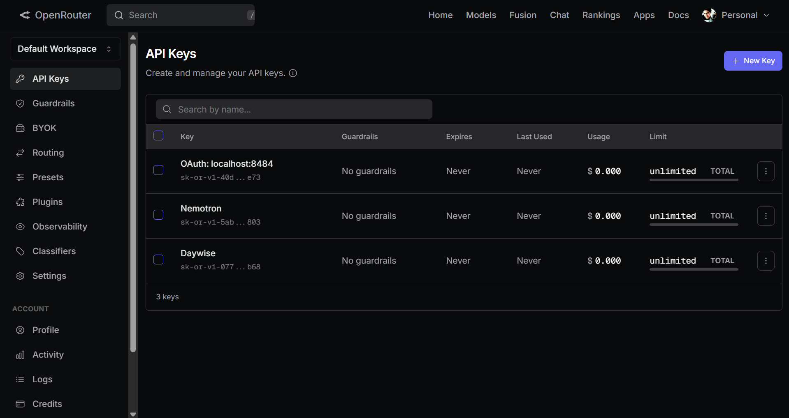
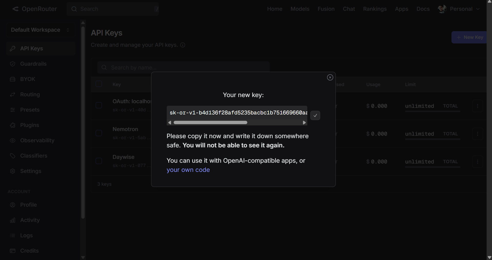
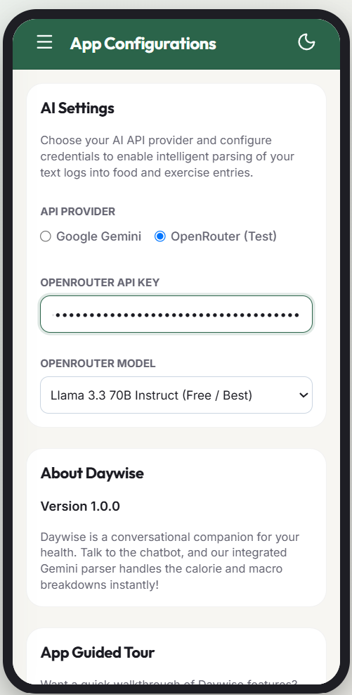

# 🔑 How to Get an OpenRouter API Key

Daywise supports OpenRouter as a fallback provider, giving you access to open-weight models like Llama 3 and Mistral. Follow these steps to obtain an API key:

---

### Step 1: Visit OpenRouter
1. Open your browser and go to the official OpenRouter website: [https://openrouter.ai/](https://openrouter.ai/)
2. Sign up or log in using your Google account, GitHub account, or email.

---

### Step 2: Navigate to API Keys Settings
1. Click on your profile icon in the top-right corner and select **"Keys"** or go to [https://openrouter.ai/keys](https://openrouter.ai/keys).
2. Click the **"Create Key"** button.

---

### Step 3: Name and Generate
1. Enter a descriptive name for your key (e.g., *Daywise App*).
2. Click **"Create"**.
3. Copy the generated key immediately. *Note: You will not be able to view it again after closing the dialog.*

---

### Step 4: Save key in Daywise
1. Open the Daywise application.
2. Navigate to **Menu > Settings**.
3. Under **API Provider**, select **OpenRouter**.
4. Paste the copied key into the **OpenRouter API Key** input field.
5. Select your preferred fallback model (e.g. `meta-llama/llama-3.3-70b-instruct:free`) from the dropdown.

