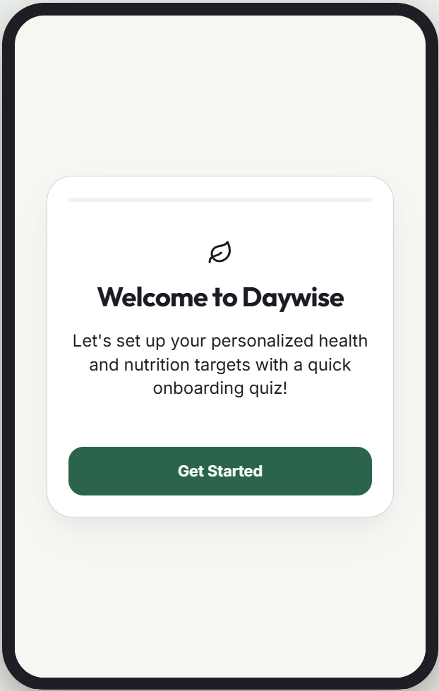
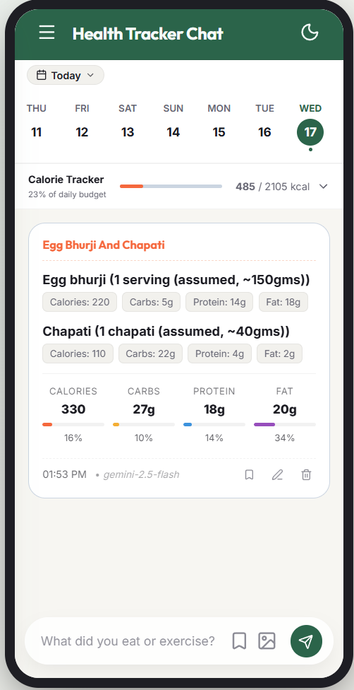
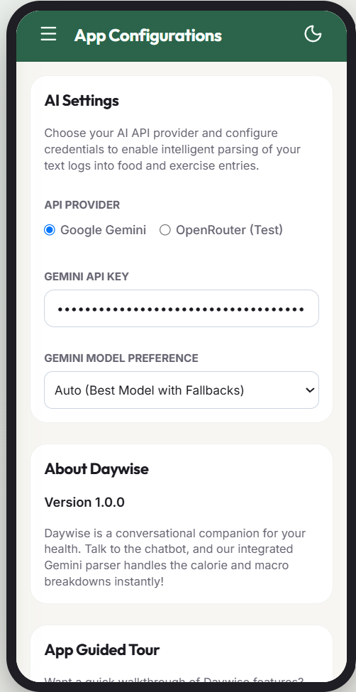
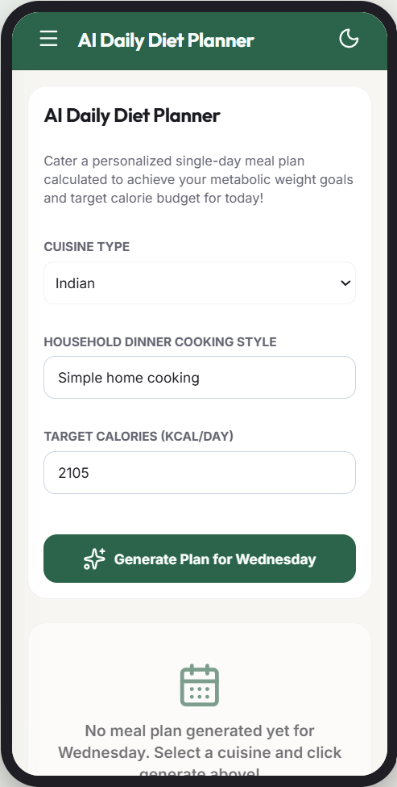
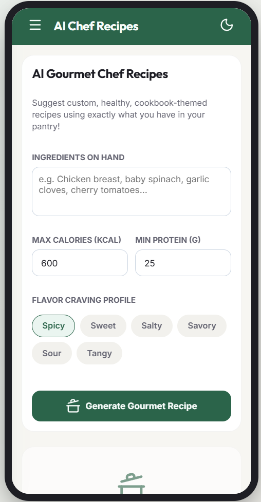
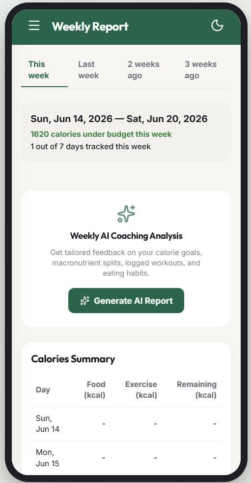
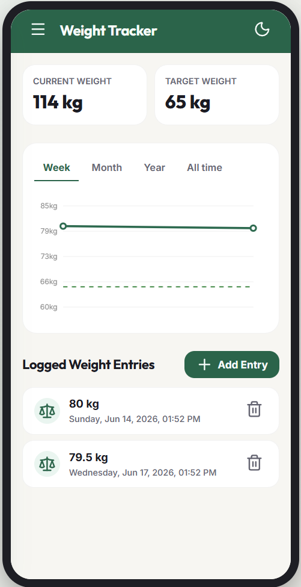
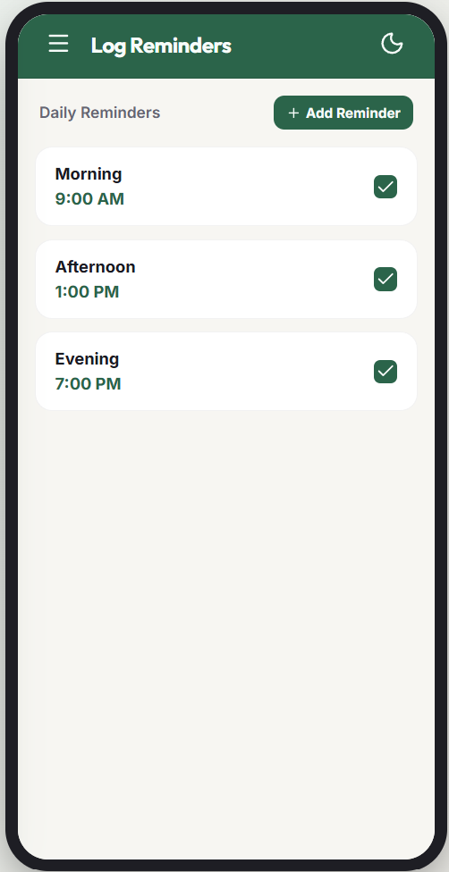

# 📸 Daywise App Studio Tour

This document showcases the visual layout and user interface screens of the Daywise Health Tracker application.

---

## 1. Onboarding Quiz Flow
A multi-step setup wizard that requests biological profile data, calculates current BMI, determines Daily BMR/TDEE targets, presents quota disclaimers, and walks the user through configuring or skipping the API key.

---

## 2. Daily Tracker Chat (Home Screen)
The central chat interface where user text logs are converted into visual cards showing exact food macro/calorie breakdowns and active workouts. A date switcher at the top lets users look back at previous tracking history.

---

## 3. Settings & API Configurations
Allows users to switch API providers (Google Gemini or OpenRouter), configure custom keys, set preferred inference models (e.g. Llama-3.3, Gemma-2, or Gemini-2.5), and toggle between Light/Dark/System themes.

---

## 4. AI Daily Diet Planner
Generates personalized meal ideas based on the daily calorie budgets. Users can view recipes, search meals, and instantly log items.

---

## 5. AI Chef Recipes
Suggests healthy, custom meals that can be cooked using whatever ingredients the user currently has in their pantry, complete with step-by-step directions and macro estimates.

---

## 6. Weekly Summary & Metrics
Tracks daily calories, macro percentages, and budgets consumed versus remaining across a rolling 7-day period.

---

## 7. Weight Tracker
Charts historical weight measurements against user goals using a clean, interactive canvas line chart.

---

## 8. Reminders & Scheduling
A panel allowing users to toggle and customize daily morning, afternoon, and evening reminders, which sync directly to the Android System Alarm Manager.

